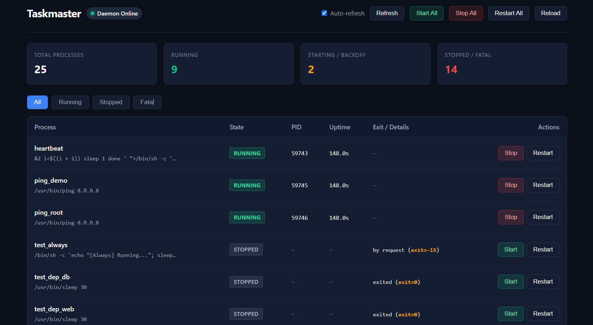
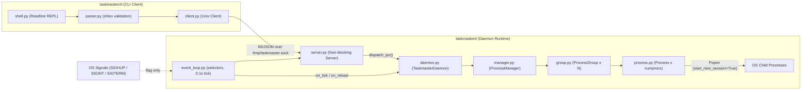
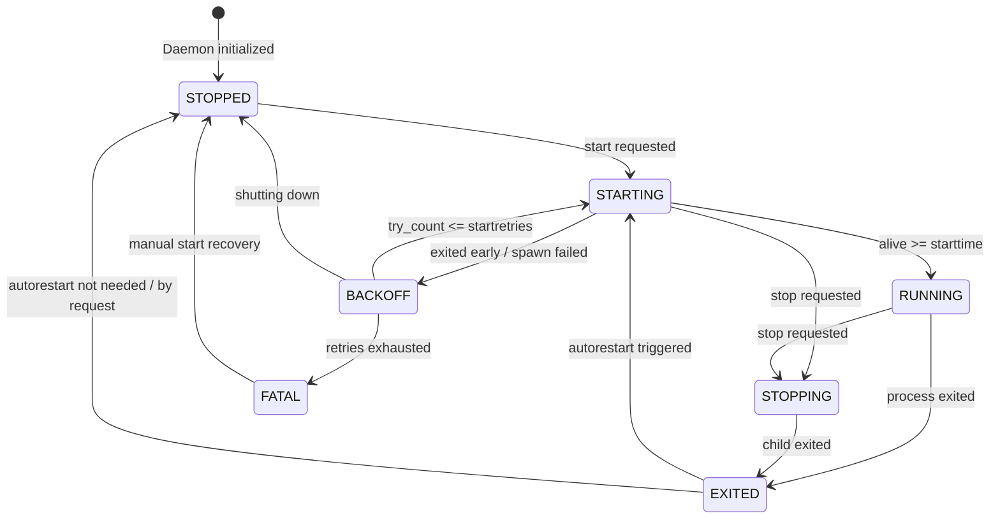

# Taskmaster

Taskmaster is a **job-control daemon modeled on `supervisor` 3.1**, implemented in Python using **only the standard library** for a 42 School.

It starts programs as child processes, keeps them alive according to their config, hot-reloads the config
on `SIGHUP`, logs what happens to a file, and comes with a control shell (`status/start/stop/restart/reload/shutdown`).

Implemented bonuses include the **client/server** architecture (`taskmasterd` and `taskmasterctl` over a Unix socket), **privilege drop**, and **advanced logging** (syslog + rotating file). Additional extensions implemented beyond the subject requirements include **dependency ordering** (`depends_on`) and a **Web Dashboard** (`taskmasterweb` on port 9001).



---

## Tech Stack & Constraints

| Component | Choice | Details |
|---|---|---|
| **Language** | Python ≥ 3.11 | Required for stdlib `tomllib` (built and tested on Python 3.14) |
| **Dependencies** | **Standard Library Only** | Zero external pip dependencies; no external packages needed |
| **Concurrency** | Single-Threaded Event Loop | Non-blocking I/O using `selectors.DefaultSelector` + 100 ms tick loop |
| **Processes** | `subprocess.Popen` | Process group isolation (`start_new_session=True`), direct execution (`shell=False`) |
| **IPC** | `AF_UNIX` Stream Socket | Non-blocking server and client exchanging framed NDJSON lines |
| **Configuration** | TOML (`tomllib`) | Validated at parse boundary into typed dataclasses |
| **Testing** | `unittest` | Complete test suite covering config validation, IPC, parser, and FSM |

---

## Repository Layout

```text
taskmaster/
├── taskmasterd            # Daemon entry point (CLI args: -c/--config, -f/--foreground, -d/--daemon)
├── taskmasterctl          # Interactive control shell entry point
├── taskmasterweb          # Web dashboard client entry point (HTTP on :9001)
├── config.toml            # Reference & evaluation configuration
├── README.md              # Project documentation
├── docs/
│   └── ipc-protocol.md    # NDJSON protocol contract
├── src/
│   ├── config/            # Configuration loading, validation, and diffing
│   │   ├── models.py      #   GlobalConfig & ProgramConfig dataclasses + field validators
│   │   ├── loader.py      #   load_config(path) -> (GlobalConfig, dict[str, ProgramConfig])
│   │   ├── diff.py        #   diff_programs(old, new) -> ConfigDiff (added, removed, changed, unchanged)
│   │   ├── privileges.py  #   drop_privileges(user) for root startup
│   │   └── __init__.py    #   Public re-exports for the config package
│   ├── core/              # Core daemon runtime
│   │   ├── daemon.py      #   TaskmasterDaemon: initialization, IPC routing, reload, shutdown
│   │   ├── event_loop.py  #   EventLoop: selector polling + signal flags (SIGHUP, SIGINT, SIGTERM)
│   │   ├── manager.py     #   ProcessManager: process groups, target resolution, diff applying
│   │   └── logger.py      #   setup_logging(): rotating file + syslog + optional stdout (-f)
│   ├── process/           # Process lifecycle and state management
│   │   ├── state.py       #   ProcessState enum, ALLOWED_TRANSITIONS table, and tick handlers
│   │   ├── process.py     #   Process: single process wrapper (Popen, PID, signals, logs)
│   │   └── group.py       #   ProcessGroup: manages replicas (numprocs) and pending restarts
│   └── ipc/               # Inter-process communication
│       ├── protocol.py    #   Wire protocol constants (SOCKET_PATH, MAX_MESSAGE_SIZE) & RequestError
│       ├── server.py      #   ServerIPC: non-blocking NDJSON server (daemon side)
│       ├── client.py      #   ClientIPC: one request per connection (ctl side)
│       ├── parser.py      #   Command parser (shlex, argument count & type validation)
│       └── shell.py       #   REPL: readline history/completion, response rendering
│   └── web/               # Web dashboard and HTTP REST API
│       ├── server.py      #   ThreadingHTTPServer, REST handlers (/api/status, /api/action)
│       └── dashboard.html #   Self-contained SPA dashboard (vanilla JS/CSS)
├── tests/                 # unittest suites
└── logs/                  # runtime output (git-ignored)
```

---

## Architecture & Design

### Client / Server Architecture

The daemon and control shell run in separate OS processes communicating over an `AF_UNIX` stream socket using framed JSON lines:



---

### Process Finite State Machine (FSM)

Each process instance is governed by an explicit Finite State Machine. Transitions outside `ALLOWED_TRANSITIONS` are rejected with `InvalidTransition`.



#### State Definitions & Status Information

| State | Process Active? | Description |
|---|:---:|---|
| **`STOPPED`** | No | Process is not running. Displays `stop_reason`. |
| **`STARTING`** | Yes | Process has been spawned and is waiting to remain alive for `starttime` seconds. |
| **`RUNNING`** | Yes | Process remained alive for `starttime` seconds; reported with active `uptime_seconds`. |
| **`BACKOFF`** | No | Process died before reaching `starttime`; waiting for automatic retry attempt. |
| **`STOPPING`** | Yes | `stopsignal` was sent; waiting up to `stoptime` seconds before escalating to `SIGKILL`. |
| **`EXITED`** | No | Process exited from `RUNNING` or `STOPPING`; intermediate state evaluating autorestart policy. |
| **`FATAL`** | No | Process failed to start after `startretries` attempts. Can be recovered via manual `start`. |

---

### Target Resolution & Process Grouping

`ProcessManager` resolves command targets in hierarchical order:
1. **`all`**: Applies the action across every configured program group.
2. **Group Name** (`<program>`): Targets all replicas belonging to the group (e.g., `worker` starts/stops all instances of `worker`).
3. **Instance Name** (`<program>_<i>`): Targets a specific single replica (e.g., `worker_0`). For programs where `numprocs = 1`, the group name and instance name are identical.

---

## Configuration Reference (`config.toml`)

Taskmaster configuration files use the standard **TOML** format, split into an optional `[global]` daemon table and one or more `[program.<name>]` tables.

### Global Settings

Evaluated exclusively at daemon startup:

```toml
[global]
logfile  = "./logs/taskmaster.log"   # Path to the daemon log file (default: /tmp/taskmaster.log)
loglevel = "info"                    # Log level: DEBUG | INFO | WARNING | ERROR | CRITICAL
user     = "nobody"                  # Unprivileged username to drop root permissions to
```

---

### Program Settings

Only the section header `[program.<name>]` and `cmd` are required. All other parameters are optional with sensible defaults.

#### Minimal Configuration
```toml
[program.simple]
cmd = "/usr/bin/sleep 60"
```

#### Full Reference
```toml
[program.worker]
cmd          = "/usr/bin/python3 -u worker.py"  # required: command line (split with shlex)
numprocs     = 3                                # default 1: number of parallel instances
autostart    = true                             # default true: start on daemon launch
autorestart  = "unexpected"                     # default "unexpected": always | never | unexpected
exitcodes    = [0, 2]                           # default [0]: expected exit codes
starttime    = 5                                # default 5: seconds alive to reach RUNNING
startretries = 3                                # default 3: retries before FATAL
stopsignal   = "TERM"                           # default "TERM": graceful stop signal
stoptime     = 10                               # default 10: seconds before SIGKILL
stdout       = "./logs/worker.log"              # default None (/dev/null): stdout path
stderr       = "./logs/worker.err"              # default None (/dev/null): stderr path
env          = { LOG_LEVEL = "debug" }          # default {}: extra environment variables
workingdir   = "/tmp"                           # default None: working directory (must exist)
umask        = "022"                            # default None: file creation mask (octal)
depends_on   = ["db"]                           # default []: programs that must reach RUNNING before start
```

---

## Control Shell (`taskmasterctl`)

`taskmasterctl` connects to `taskmasterd` over the local Unix domain socket and presents an interactive shell supporting readline line editing, history, and the following commands:

| Command | Syntax | Description |
|---|---|---|
| **`status`** | `status [TARGET]` | Display process state, PID, uptime, exit code, and stop reason for all programs |
| **`start`** | `start <TARGET\|all>` | Start the specified program, instance, or all programs (recovers `FATAL` processes) |
| **`stop`** | `stop <TARGET\|all>` | Gracefully stop the specified program, instance, or all programs |
| **`restart`** | `restart <TARGET\|all>` | Gracefully stop and immediately restart processes upon reaching terminal state |
| **`reload`** | `reload` | Reload `config.toml` on the fly without stopping unchanged processes |
| **`shutdown`** | `shutdown` | Stop all managed child processes and cleanly terminate the daemon |
| **`help`** | `help` | Display built-in command documentation |
| **`quit`** | `quit` | Exit the interactive shell (the daemon continues running) |

---

## Getting Started & Usage

### Starting the Daemon

Run `taskmasterd` in silent mode (default, logs written to `logfile` and syslog; for background execution):
```bash
./taskmasterd &
```

Or run in the foreground with colored log output directly to `stdout` (`-f` / `--foreground`):
```bash
./taskmasterd -f
```

Or specify a custom configuration file path using `-c` / `--config`:
```bash
./taskmasterd -c /path/to/my_config.toml
```

### Using the Interactive Shell

In another terminal, launch `taskmasterctl`:
```bash
./taskmasterctl
```

### Using the Web Dashboard

Launch the web interface (default port 9001):
```bash
./taskmasterweb
```
Open `http://127.0.0.1:9001` in any browser to monitor status and trigger actions with real-time auto-refresh.
Customize the port or host using `-p` / `--port` and `-H` / `--host`:
```bash
./taskmasterweb -p 9000 -H 0.0.0.0
```

### Running the Test Suite

Run all unit and integration tests using Python's standard `unittest` discovery:
```bash
python3 -m unittest discover -s tests -v
```
